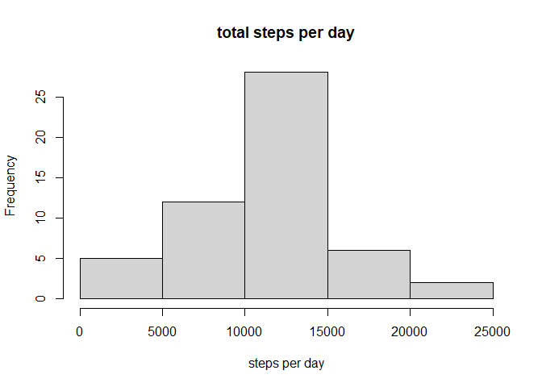
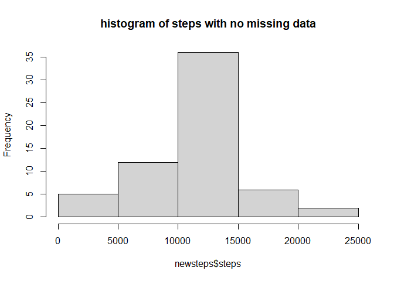

## Loading and preprocessing the data from the github repository

```r
unzip("activity.zip")
activitydata <- read.csv("activity.csv")
summary(activitydata)
```

```
##      steps            date              interval     
##  Min.   :  0.00   Length:17568       Min.   :   0.0  
##  1st Qu.:  0.00   Class :character   1st Qu.: 588.8  
##  Median :  0.00   Mode  :character   Median :1177.5  
##  Mean   : 37.38                      Mean   :1177.5  
##  3rd Qu.: 12.00                      3rd Qu.:1766.2  
##  Max.   :806.00                      Max.   :2355.0  
##  NA's   :2304
```

##Make data more readable by transforming dates and ascertaining number of missing data

```r
library(lubridate)
```

```
## 
## Attaching package: 'lubridate'
```

```
## The following objects are masked from 'package:base':
## 
##     date, intersect, setdiff, union
```

```r
activitydata$date <- ymd(activitydata$date)
summary(activitydata)
```

```
##      steps             date               interval     
##  Min.   :  0.00   Min.   :2012-10-01   Min.   :   0.0  
##  1st Qu.:  0.00   1st Qu.:2012-10-16   1st Qu.: 588.8  
##  Median :  0.00   Median :2012-10-31   Median :1177.5  
##  Mean   : 37.38   Mean   :2012-10-31   Mean   :1177.5  
##  3rd Qu.: 12.00   3rd Qu.:2012-11-15   3rd Qu.:1766.2  
##  Max.   :806.00   Max.   :2012-11-30   Max.   :2355.0  
##  NA's   :2304
```

## What is mean total number of steps taken per day?

##Calculate total number of steps per day

```r
stepstotalday <- aggregate(steps ~ date, activitydata, sum, na.rm = TRUE)
print(stepstotalday)
```

```
##          date steps
## 1  2012-10-02   126
## 2  2012-10-03 11352
## 3  2012-10-04 12116
## 4  2012-10-05 13294
## 5  2012-10-06 15420
## 6  2012-10-07 11015
## 7  2012-10-09 12811
## 8  2012-10-10  9900
## 9  2012-10-11 10304
## 10 2012-10-12 17382
## 11 2012-10-13 12426
## 12 2012-10-14 15098
## 13 2012-10-15 10139
## 14 2012-10-16 15084
## 15 2012-10-17 13452
## 16 2012-10-18 10056
## 17 2012-10-19 11829
## 18 2012-10-20 10395
## 19 2012-10-21  8821
## 20 2012-10-22 13460
## 21 2012-10-23  8918
## 22 2012-10-24  8355
## 23 2012-10-25  2492
## 24 2012-10-26  6778
## 25 2012-10-27 10119
## 26 2012-10-28 11458
## 27 2012-10-29  5018
## 28 2012-10-30  9819
## 29 2012-10-31 15414
## 30 2012-11-02 10600
## 31 2012-11-03 10571
## 32 2012-11-05 10439
## 33 2012-11-06  8334
## 34 2012-11-07 12883
## 35 2012-11-08  3219
## 36 2012-11-11 12608
## 37 2012-11-12 10765
## 38 2012-11-13  7336
## 39 2012-11-15    41
## 40 2012-11-16  5441
## 41 2012-11-17 14339
## 42 2012-11-18 15110
## 43 2012-11-19  8841
## 44 2012-11-20  4472
## 45 2012-11-21 12787
## 46 2012-11-22 20427
## 47 2012-11-23 21194
## 48 2012-11-24 14478
## 49 2012-11-25 11834
## 50 2012-11-26 11162
## 51 2012-11-27 13646
## 52 2012-11-28 10183
## 53 2012-11-29  7047
```
## Make a histogram illustrating total number of steps per day

```r
hist(stepstotalday$steps, main =  "total steps per day", xlab = "steps per day")
```

<!-- -->
## Calculate mean and median of total steps per day

```r
mean(stepstotalday$steps)
```

```
## [1] 10766.19
```


```r
median(stepstotalday$steps)
```

```
## [1] 10765
```


## What is the average daily activity pattern?

##Create a time series plot of the 5-min interval as the x-axis and average number of steps taken averaged over days as the y-axis

```r
intervalsteps <- aggregate(steps ~ interval, data = activitydata, mean, na.rm = TRUE)
plot(steps~interval, data = intervalsteps, type = "l")
```

<!-- -->

##Answer the question: Which 5-minute interval, on average across all the days in the dataset, contains the maximum number of steps?

##Extract this answer with the which.max function

```r
maxsteps <- intervalsteps[which.max(intervalsteps$steps),]$interval
maxsteps
```

```
## [1] 835
```


## Imputing missing values

##Calculate and report number of missing values in this data set

```r
missingmissing <- sum(is.na(activitydata$steps))
print(missingmissing)
```

```
## [1] 2304
```
                  
##Strategy: fill in the mean per interval as a substitute for all NA. Extract mean per interval

```r
meaninterval <- function(interval){intervalsteps[intervalsteps$interval==interval,]$steps}
```

##Make a new data set filling in the missing data with the means extracted from the above function

```r
datasansNA <- activitydata 
for (i in 1:nrow(datasansNA)){if(is.na(datasansNA[i,]$steps)){datasansNA[i,]$steps <- meaninterval(datasansNA[i,]$interval)}}
head(datasansNA)
```

```
##       steps       date interval
## 1 1.7169811 2012-10-01        0
## 2 0.3396226 2012-10-01        5
## 3 0.1320755 2012-10-01       10
## 4 0.1509434 2012-10-01       15
## 5 0.0754717 2012-10-01       20
## 6 2.0943396 2012-10-01       25
```

##Make a new histogram with this filled in data set, showing total number of steps taken each day

```r
newsteps <- aggregate(steps ~ date, datasansNA, sum)
hist(newsteps$steps, main = "histogram of steps with no missing data")
```

<!-- -->
##Extract mean and median for this new set

```r
mean(newsteps$steps)
```

```
## [1] 10766.19
```


```r
median(newsteps$steps)
```

```
## [1] 10766.19
```


## Are there differences in activity patterns between weekdays and weekends?
##Create a new factor variable in the dataset with two levels – “weekday” and “weekend” indicating whether a given date is a weekday or weekend day.

```r
datasansNA$NewDate <- as.Date(datasansNA$date, format = "%Y-%m-%d")
datasansNA$weekday <- weekdays(datasansNA$NewDate)

datasansNA$Days <- ifelse(datasansNA$weekday=='Saturday' | datasansNA$weekday=='Sunday', 'weekend','weekday')

head(datasansNA)
```

```
##       steps       date interval    NewDate weekday    Days
## 1 1.7169811 2012-10-01        0 2012-10-01  Monday weekday
## 2 0.3396226 2012-10-01        5 2012-10-01  Monday weekday
## 3 0.1320755 2012-10-01       10 2012-10-01  Monday weekday
## 4 0.1509434 2012-10-01       15 2012-10-01  Monday weekday
## 5 0.0754717 2012-10-01       20 2012-10-01  Monday weekday
## 6 2.0943396 2012-10-01       25 2012-10-01  Monday weekday
```
##Make a panel plot containing a time series plot (i.e. 𝚝𝚢𝚙𝚎 = “𝚕”) of the 5-minute interval (x-axis) and the average number of steps taken, averaged across all weekday days or weekend days (y-axis).


```r
stepsweekdays <- aggregate(steps ~ interval + Days, datasansNA, mean)
names(stepsweekdays) <- c("interval", "day", "steps")
library(lattice)
xyplot(steps ~ interval | day, stepsweekdays, type = "l", layout = c(1, 2), 
    xlab = "Interval", ylab = "Number of steps")
```

<!-- -->
